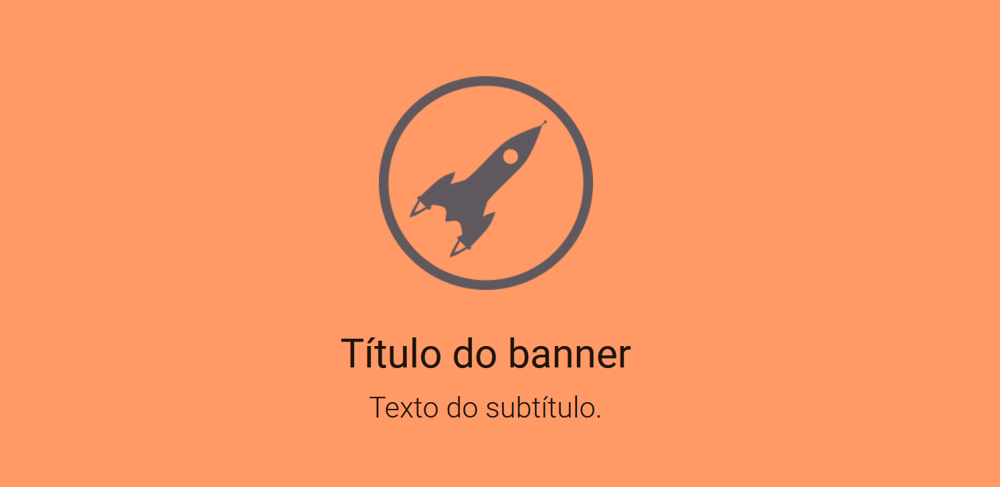
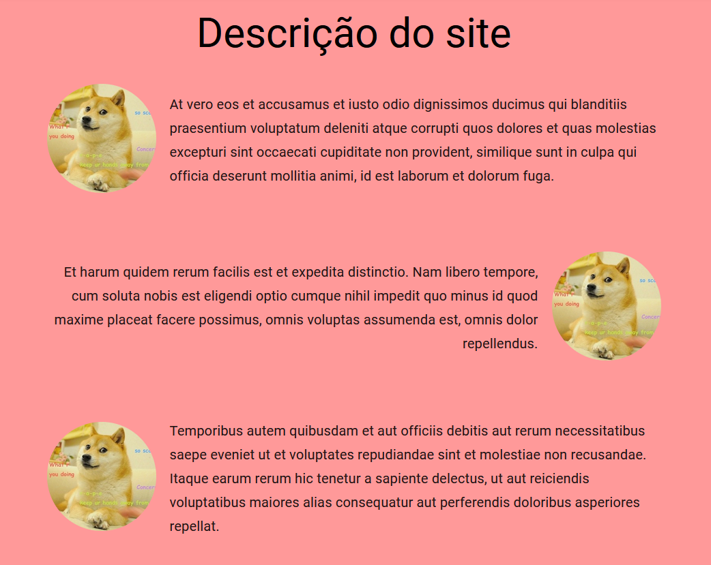
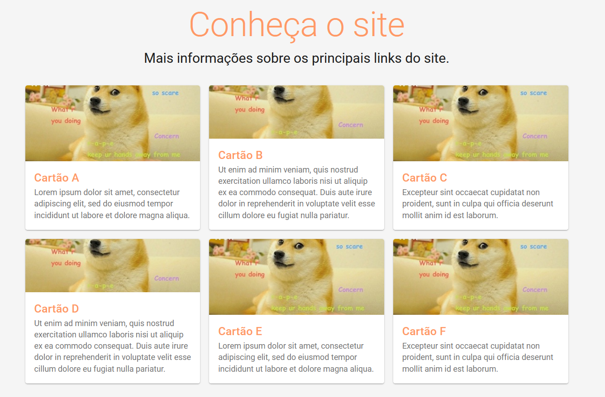
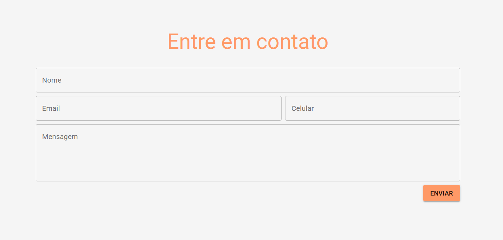
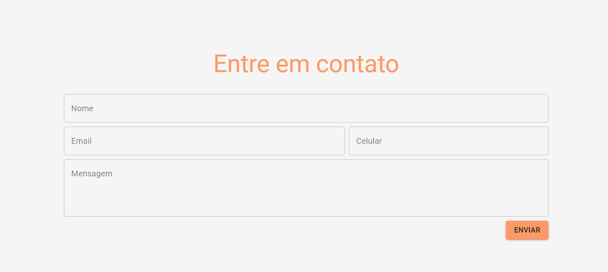
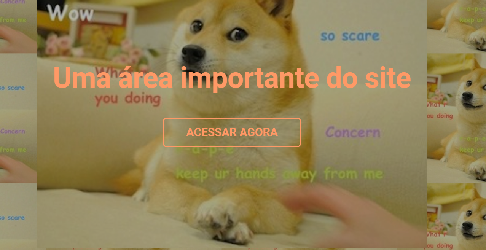
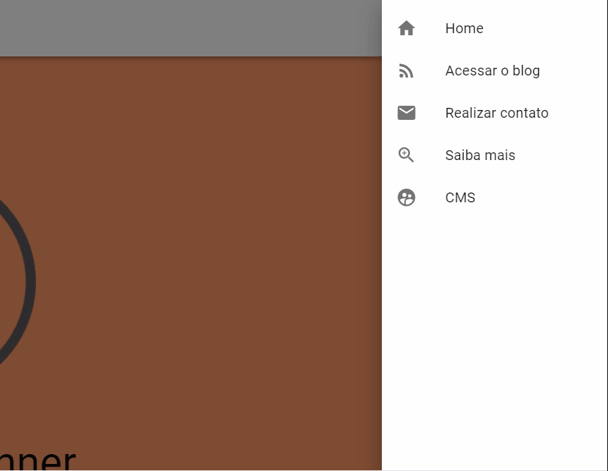

# AT - Mobile-first UI com React

**PRESTE ATENÇÃO NOS ITENS DE RUBRICA AO FINAL DO ENUNCIADO!**
**LEIA ATÉ O FINAL ANTES DE COMEÇAR, POIS VOCÊ PODE FECHAR MAIS DE UM AT POR VEZ!**

Ué! O AT é uma questão só?

Pois é! Mas te prepara porque é A QUESTÃO!

No entanto, você só precisa fazer uma coisa: implementar esse site:

https://egvelho-blog-template.netlify.app/

Sim, tudo que está aí nessa tela você precisa implementar, inclusive responsividade! Vamos aos detalhes:

### O que não é necessário implementar

- A AppBar NÃO PRECISA aparecer e reaparecer dependendo do scroll. Se você conseguir implementar dessa forma, seria muito legal, mas eu aceito que ela fique fixa no topo utilizando `position` `sticky`;
- Não é necessário implementar a navegação inferior (BottomNavigation) que existe no modo mobile;
- A animação ao dar foco nos elementos do formulário de contato, isso é trabalhoso e você NÃO PRECISA fazer;
- As outras telas do site. Você só precisa implementar a tela principal, as outras, que você consegue acessar clicando nos links, NÃO É NECESSÁRIO implementar.

### O que não precisa ser igual

- Você pode utilizar as imagens e textos que desejar;
- Você pode utilizar quaisquer cores que achar mais interessante.

### O que precisa ser igual

- Os espaçamentos (`padding`, `margin`, `width`, `height`, etc.) precisam ser bem próximos do que está na página;
- O estilo do site precisa ser o mesmo! Ou seja, tente manter as mesmas bordas e estilos de texto (negrito, maiúsculas).

### Como eu sei quais cores, dimensões e breakpoints utilizar?

Olhando o código da página pelas ferramentas de desenvolvimento do navegador! Um dos desafios desse AT é realizar engenharia reversa no site em questão.

Mas, também vou liberar o código fonte desse site: https://github.com/egvelho/next-material-netlify-cms-blog

Só que esse código não vai te ajudar muito!

### As coisas precisam ser EXATAMENTE IGUAIS?

Não! tente fazer o mais próximo que conseguir, mas não precisa ser perfeitamente igual.

### Quais tecnologias de CSS posso utilizar?

A não ser que algum enunciado de AT exija o uso de alguma tecnologia em específico, você pode optar entre arquivos CSS, módulos CSS, styled-components ou TailwindCSS. **Mas somente estes!**

**JÁ ESTÁ TUDO CONFIGURADO! É SÓ CODAR!**

### Itens de rubrica

Como você sabe, a avaliação ocorre através do cumprimento de competências, e a aprovação na disciplina ocorre quando metade dos itens de rubrica de cada competência são atingidos.

No caso desta disciplina, são três competências com quatro itens de rubrica em cada uma. Assim, nesse AT você será avaliado em doze critérios, cada critério é respectivo à um item de rubrica, e são os seguintes:

#### Competencia 1: Construir layouts em CSS3 com Flexbox

##### AT 1 - Implementar o banner utilizando FlexBox

##### AT 2 - Implementar a app bar utilizando FlexBox

##### AT 3 - Implementar a descrição do site utilizando FlexBox

##### AT 4 - Implementar o rodapé do site utilizando FlexBox (não é necessário implementar a rolagem horizontal)

#### Competência 2: Criar páginas web responsivas com CSS3

##### AT 5 - Implementar a grid de cards utilizando CSS Grid (O título e o subtítulo podem ser com FlexBox, a parte interna dos cards também)

##### AT 6 - Implementar a responsividade da grid de cards utilizando media queries

##### AT 7 - Implementar o formulário de contato utilizando grid-template-areas (o botão de enviar não precisa estar dentro da grid, nem o título e o subtítulo, pode utilizar FlexBox nessas partes)

##### AT 8 - Implemenetar a responsividade do formulário de contato utilizando media queries

##### Competência 3: Estilizar componentes React com CSS3

##### AT 9 - Implementar o segundo banner utilizando SOMENTE estilo inline (não é necessário implementar as media queries)

##### AT 10 - Criar ao menos cinco componentes (se você criou cinco componentes implementando os ATs anteriores, já fechou esse!)

##### AT 11 - Estilizar o formulário de contato utilizando TailwindCSS. Utilize Tailwind para estilizar as bordas, espaçamentos, cores, título e subtítulo do formulário. **A PARTE DE RESPONSIVIDADE E QUE UTILIZA AS PROPRIEDADES DE GRID CSS PODEM PERMANECER EM CSS NORMAL**.

##### AT 12 - Desafio: implementar o drawer utilizando styled-components (com animação, backdrop e botão de abrir/fechar funcionando)

**Boa sorte!**